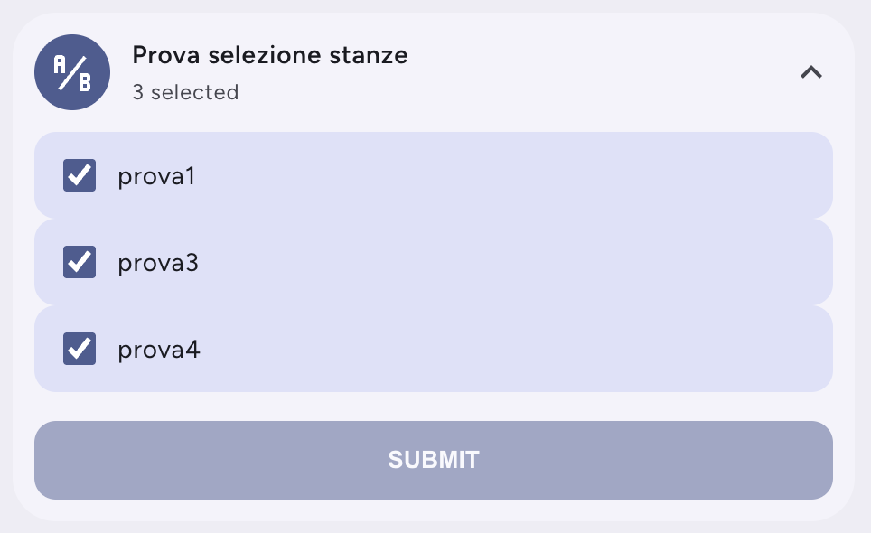

# Input Multiselect Card




A custom Lovelace card for Home Assistant designed to interact with `input_multiselect` entities.

By default, Home Assistant does not provide a UI element to select multiple options simultaneously. This card bridges that gap by providing a clean, expandable dropdown menu with checkboxes. It features a modern, rounded design inspired by Bubble Card, making it perfectly suited for mobile-first dashboards.

**⚠️ Important:** This card is just the frontend interface. It requires the backend [Input Multiselect component](https://github.com/portbusy/ha-input-multiselect) to be installed and configured in your Home Assistant instance. It will **not** work with native `input_select` entities.

## Features

- **Fast rendering** — the editor and card are built with programmatic DOM creation, no lag or delays
- **Any entity** — the entity picker shows all entities (no domain filter), so you can pair it with any `input_multiselect` entity
- **Dynamic icon** — the icon picker shows the entity's current icon and allows override; updates live when changed
- **Standard HA action selector** — uses the native `ui-action` selector inside an expandable "Interactions" panel, just like premium cards (Mushroom, Bubble, etc.)
- **Default submit action** — on submit, the card always calls `input_multiselect.set_options` to update the entity's selected options
- **Configurable tap action** — optionally execute an additional action after submit (navigate, call-service, more-info, URL, toggle, assist)

## Installation

### HACS (Recommended)
This card can be installed via [HACS](https://hacs.xyz/).

1. Go to HACS -> Frontend.
2. Click the three dots in the top right corner and select **Custom repositories**.
3. Paste the URL of this repository and select **Lovelace** as the category.
4. Click Add, search for "Input Multiselect Card", and install it.
5. When prompted, reload your browser resources.

### Manual
1. Download the `input-multiselect-card.js` file from this repository.
2. Copy it into your `config/www/` directory.
3. Go to **Settings** -> **Dashboards** -> **Three dots (top right)** -> **Resources**.
4. Add a new resource with the URL `/local/input-multiselect-card.js` and set the type to **JavaScript Module**.
5. Refresh your browser.

## Configuration

You can configure this card using the Visual Editor or manually via YAML.

### Visual Editor
1. Edit your dashboard and click **Add Card**.
2. Search for **Input Multiselect** in the custom cards section.
3. Select your entity from the dropdown.
4. Optionally set a custom name and icon.
5. Expand the **Interactions** panel to configure an action on submit.

### YAML Configuration

```yaml
type: custom:input-multiselect-card
entity: input_multiselect.rooms_to_clean
name: Cleaning Zones
icon: mdi:robot-vacuum
tap_action:
  action: none
```

### Options

| Option       | Type   | Required | Default                | Description                                                        |
|:-------------|:-------|:---------|:-----------------------|:-------------------------------------------------------------------|
| `entity`     | string | ✅ Yes   |                        | Entity ID (typically an `input_multiselect` entity)                |
| `name`       | string | No       | Entity's friendly name | Display name shown in the card header                              |
| `icon`       | string | No       | Entity's icon          | Icon override (e.g. `mdi:robot-vacuum`). Falls back to entity icon, then `mdi:format-list-checks` |
| `tap_action` | object | No       | `action: none`         | Additional action executed after submit (see below)                |

### Tap Action

The `tap_action` defines an **additional** action executed after the default `input_multiselect.set_options` call. It uses the standard Home Assistant action format:

| Action            | Description                          | Extra fields                                    |
|:------------------|:-------------------------------------|:------------------------------------------------|
| `none`            | No additional action (default)       |                                                 |
| `more-info`       | Open the entity's more-info dialog   | `entity` (optional, defaults to card entity)    |
| `navigate`        | Navigate to a HA view                | `navigation_path` (e.g. `/lovelace/cleaning`)   |
| `url`             | Open an external URL                 | `url_path`                                      |
| `call-service`    | Call any HA service                  | `service`, `data`, `target`                     |
| `perform-action`  | Same as call-service (new HA format) | `perform_action`, `data`, `target`              |
| `toggle`          | Toggle an entity                     | `entity` (optional)                             |
| `assist`          | Start the voice assistant            |                                                 |

#### Example: navigate after submit

```yaml
type: custom:input-multiselect-card
entity: input_multiselect.rooms_to_clean
name: Cleaning Zones
icon: mdi:robot-vacuum
tap_action:
  action: navigate
  navigation_path: /lovelace/cleaning
```

#### Example: call a service after submit

```yaml
type: custom:input-multiselect-card
entity: input_multiselect.rooms_to_clean
name: Cleaning Zones
tap_action:
  action: call-service
  service: script.start_cleaning
  data:
    mode: turbo
```

## How It Works

1. The card displays a collapsible header with the entity's icon, name, and current state.
2. Clicking the header expands a dropdown showing all available options as checkboxes.
3. Check/uncheck the options you want — the **SUBMIT** button enables when the selection differs from the current state.
4. On submit:
   - The card calls `input_multiselect.set_options` to update the entity with the new selection.
   - If a `tap_action` is configured, it is executed immediately after.
   - The dropdown closes automatically.